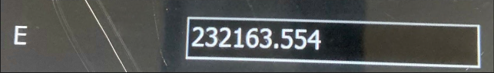
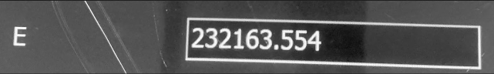
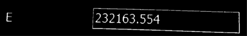
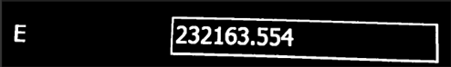
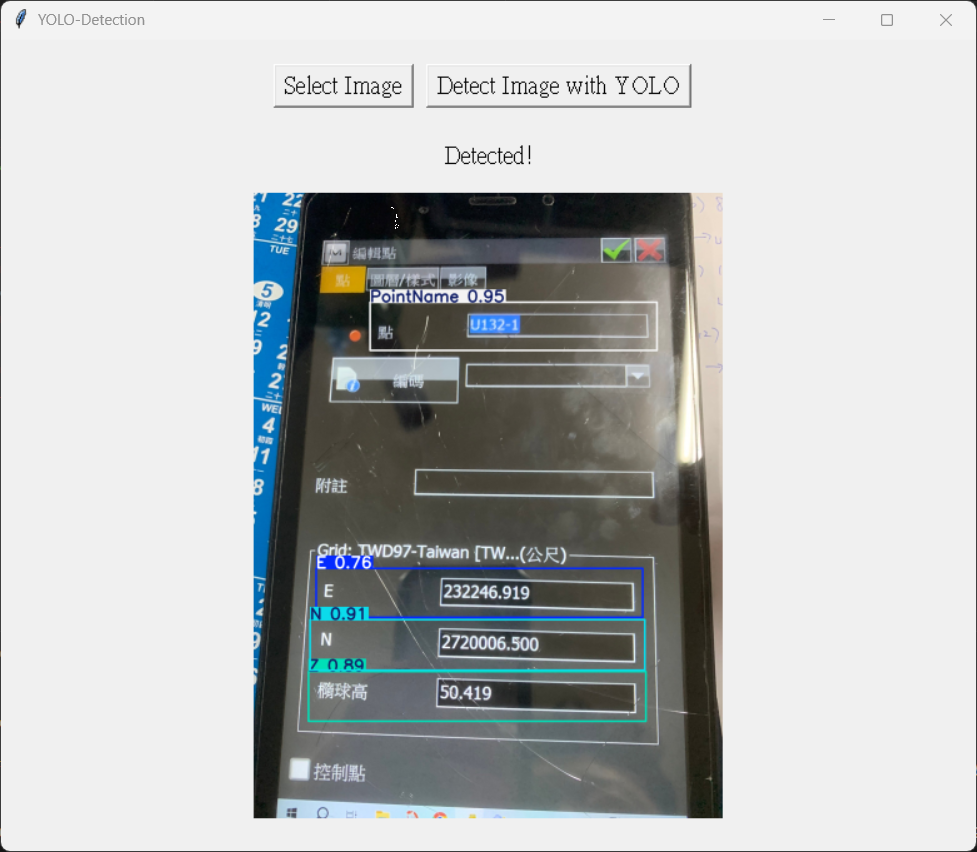

# NEZYOLO Project

This project classifies different Geographic Information System (GIS) images using YOLO (You Only Look Once) object detection, and using Tesseract OCR show in WebForm application.

## Overview

The raw images contain the following information:
- 紀錄 (Records)
- 解狀態 (Solution Status)
- 北座標 (N - North Coordinate)
- 東座標 (E - East Coordinate)
- 橢球高 (Z - Ellipsoidal Height)
- HRMS (水平經度 - Horizontal RMS)
- VRMS (垂直經度 - Vertical RMS)

This project extracts N, E, 橢球高 (Z), and 點名 (Site Name) using YOLO model detection, then applies OCR (Optical Character Recognition) on the detected bounding boxes.

## Model Performance

Tested models:
- YOLOv11n with batch sizes 16 and 32
- YOLOv12n with batch sizes 16 and 32

**Best performing model: YOLOv12n**

---

## Requirements

- Python 3.13.3
- ultralytics 8.3.158
- opencv-contrib-python 4.12.0.88
- torch 2.7.1+cu118
- torchaudio 2.7.1+cu118
- torchvision 0.22.1+cu118
- CUDA 11.8

- Visual Studio Community 2022 17.11.2
- ASP.NET Web Application (.NET Framework)
- .NET framwork 4.7.2

---

## Hardware Specifications

- **CPU:** Intel(R) Core(TM) i7-8700
- **GPU:** NVIDIA GeForce RTX 3060

---

## Installation

1. **Clone the repository and navigate to the project directory:**
   ```bash
   git clone <https://github.com/LeeYuChS/NEZYOLO.git>
   cd <YOLO-Miaoli>
   ```

2. **Create and activate a virtual environment:**
   
   **Windows:**
   ```bash
   python -m venv venv
   .\venv\Scripts\activate
   ```

3. **Install the required packages:**
   ```bash
   pip install -r requirements.txt
   ```

---

## Project Structure

```
NEZYOLO-main/
├── gui/
│   ├── gui_setting.py
│   └── gui_show.py
├── ocr/
│   ├── get_bounding_box.py
│   └── split_four_image.py
├── services/
│   ├── image_service.py          # Calls split_four_image.py for image cutting
│   └── ocr_service.py            # Calls ocr.get_bounding_box.py (after YOLO)
├── data/
│   ├── images/
│   │   ├── train/
│   │   └── valid/
│   └── labels/
│       ├── train/
│       └── valid/
├── config.py                     # Configuration file for paths and settings
├── preparing_yaml.py             # Generates train/valid folders and prepares .yaml for YOLO training
├── train.py                      # YOLO model training script
├── utils.py
├── python_api.py                 # FastAPI server implementation
├── Miaoli-WebForm-OCR/                  # ASP.NET WebForm application
│   ├── packages/
│   ├── Miaoli-WebForm-OCR/
│   │   ├── App_Data/
│   │   │   └── NEZData/
│   │   │       └── Uploads/
│   │   │           └── timestamp_folder/
│   │   ├── 4OCR/
│   │   │   └── timestamp_folder/     # Web frontend image display
│   │   └── ...
│   └── Miaoli-WebForm-OCR.sln
└── README.md
```

---

## Usage

1. **Configure the project:**
   Modify `config.py` and verify the following paths:
   - `root_path`
   - `dataset_path`
   - `nowdate`
   ...

2. **Prepare the dataset:**
   Run `preparing_yaml.py` to create train/valid directories and generate the YAML file for YOLO training:
   ```bash
   python preparing_yaml.py
   ```

3. **Train the model:**
   Execute `train.py` to train the YOLO model:
   ```bash
   python train.py
   ```

4. **Configure the best model:**
   Copy the path of `best.pt` and paste it into `config.py` under `best_model_weight`.

5. **Start the API server:**
   Run the FastAPI server:
   ```bash
   python python_api.py
   ```

6. **Use the web interface:**
   Check web.config and applicationhost.config
   Launch the ASP.NET WebForm application to interact with the system through the web interface.

---

## Notes

- Ensure CUDA 11.8 is properly installed for GPU acceleration
- Verify all paths in `config.py` before training
- The WebForm application requires the Python API server to be running

---

## Demo Results

Images process:

![RGB]


![Gray]


![Erode]


![Open]



Example of YOLO detection results from the GUI:

![YOLO Detection Example]


<!-- If you want to adjust size -->
<!--  -->
